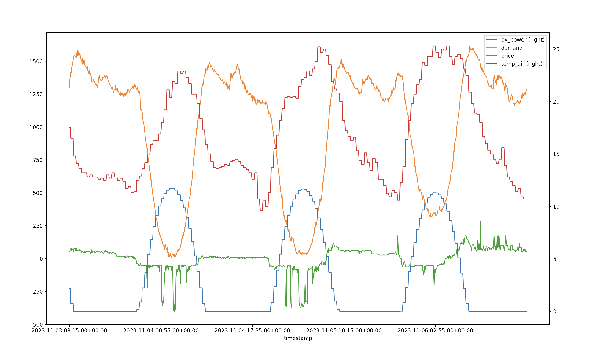
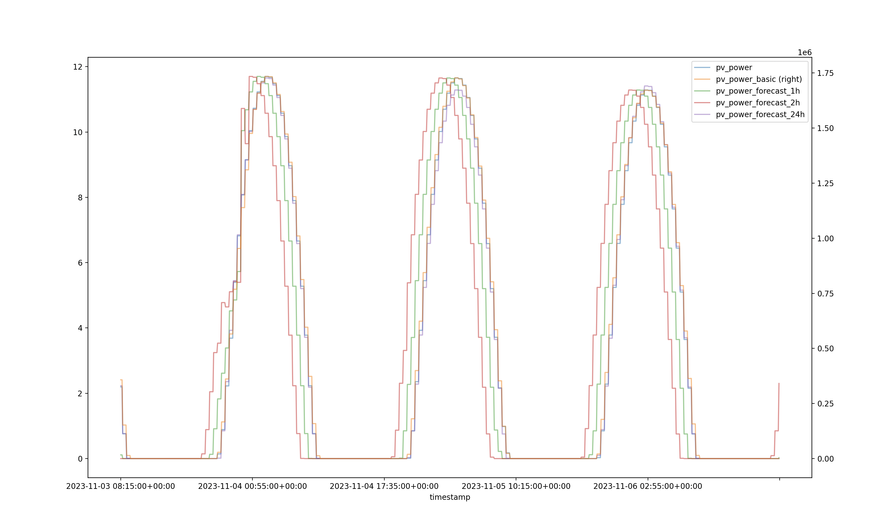

# MLAI Green Battery Hack Patch 

Through the help of participants we were able to identify two issues in the competition setup. 

1. The original training/validation data we issued had some time-misalignment. 
2. The original formulation for the battery simulator made it so that a policy of always discharging all solar directly to the grid was as optimal as any other solar policy. 

In order to improve the experience for participants we have issued a patch that fixes these issues. Please note, **you don't need to know about the specifics of this patch to participate in the competition** but if you do read about them you may get an edge. All policies that worked the patch will still work going forward. If you are interested in the specifics of the patch, please read on.

## New Training/Validation Data

We have issued new training/validation data (`training_data.csv` and `validation_data.csv`). The old `bot/data/training_data.csv` and `bot/data/validation_data.csv` was issued with a timestamp in UTC+10 but had all solcast data mis-aligned so that all values appeared 10 hours before the correct time. 

The new datasets contain a subset of the columns in the old `bot/data/training_data.csv` and `bot/data/validation_data.csv` and all the same rows, minus 20 hours. All values are aligned to UTC time. They are also set up specifically so that all columns included in either dataset have the **exact** same format as what will be encountered in the live data. Their columns are: 


- `timestamp`: The time of the observation as a UTC+0 string (National Energy Market time is always UTC+10 so you may need to shift these 10 hours forward for the times to align with the australian day/night cycle). 
- `price`: the per megawatt spot price of electricity in South Australia for that interval in AUD (courtesy of [opennem](https://opennem.org.au)).
- `demand`: the total demand for electricity in South Australia for that interval in megawatts. **Note**: because of the high penetration of rooftop solar in south australia, the demand usually reaches a minimum at around midday UTC+10 (courtesy of [opennem](https://opennem.org.au)).
- `temp_air`: the air temperature in Adelaide at that time in degrees celsius (courtesy of [opennem](https://opennem.org.au)).
- `pv_power`: the total power in kilowatts generated by the solar panel attached to the battery at that time (courtesy of [solcast](https://solcast.com)).
- `pv_power_forecast_1h`: the total power in kilowatts that the solar panel is forecasted to generate in 1 hour from that time (courtesy of [solcast](https://solcast.com)).
- `pv_power_forecast_2h`: the total power in kilowatts that the solar panel is forecasted to generate in 2 hours from that time (courtesy of [solcast](https://solcast.com)).
- `pv_power_forecast_24h`: the total power in kilowatts that the solar panel is forecasted to generate in 24 hours from that time (courtesy of [solcast](https://solcast.com)).
- `pv_power_basic`: an estimate of the total solar power in kilowatts generated by the south australian energy grid at that time (courtesy of [solcast](https://solcast.com)).

**Note**: all solcast data is only provided for 1 year, so `training_data.csv` has `NaN` values for all solcast data for the first 2 years.

You can use `plot.py` to view this data. We recommend you use the new data to train your models as it is properly aligned, but the choice is down to the individual participants.

### Data Update

After the initial data-re issue it was discovered that the temp_air column was not correctly aligned. This has now been fixed and below are given plots of the data to demonstrate that all values are correctly aligned to UTC time.

**PV Power vs all OpenNEM data**:


**PV Power vs all other solcast data**:


Note that the solar peaks are always just after midnight, UTC, which means around midday in UTC+10.

## Tariffs Added to Battery Simulation

In production we have replaced the old `bot/evaluation.py` with a new file given in this repo: `tariff_environment.py`. The new simulator is almost identical to the old one except that a percentage tariff (usually negative but sometimes positive) is applied to each profit or loss made by the battery. In practical terms this means you will probably notice a ~10% decrease in your score on the leaderboard.

**You do not need to do anything to your code to account for this change.** The change has been made on the backend and is now in place. All submissions since 11/4/2024 1800 AEST have been made using the new simulator, as will all future submissions beyond this date. That said, we do encourage you to download `tariff_environment.py` and use it to test your policies locally as this is what you will be evaluated against. Downloading this file and saving it in your repo as `bot/tariff_environment.py` will not effect your submissions in any way and you are free to alter this file as you see fit. The usual restrictions around not altering `bot/evaluation.py` still apply.

### Exact tariff algorithm: 

The tariff is calculated as follows:
```
If you are in off-peak time (0000 - 1700 and 2100 - 2400):

If you are exporting, whatever profit or loss you were going to make, you also make an additional 15% loss.

- profit or $100 -> profit of $85
- loss of $100 -> loss of $115

If you are importing, whatever profit or loss you were going to make, you also make an additional 5% loss.

- profit or $100 -> profit of $95
- loss of $100 -> loss of $105


If you are in on-peak time (1700 - 2100):

If you are exporting, whatever profit or loss you were going to make, you also make an additional 30% gain.

- profit or $100 -> profit of $130
- loss of $100 -> loss of $70

If you are importing, whatever profit or loss you were going to make, you also make an additional 40% loss.

- profit or $100 -> profit of $60
- loss of $100 -> loss of $140
```
The code from `tariff_environment.py` that implements this is:
```python

def with_tariff(self, profit, is_export, timestamp):
    if isinstance(timestamp, str):
        # timestamp is a UTC string make timestamp a pd.timestamp object then convert to EXACTLY +10, not dependent on any other timezone
        utc_timestamp = pd.Timestamp(timestamp, tz='UTC')
        plus_10 = pd.Timedelta(hours=10)
        timestamp = utc_timestamp + plus_10 

    is_peak = timestamp.hour >= 17 and timestamp.hour < 21

    if is_export:
        if is_peak:
            return profit + abs(profit * 0.30)
        return profit - abs(profit * 0.15)
    
    if is_peak:
        return profit - abs(profit * 0.40)
    return profit - abs(profit * 0.05)

```
### Why add tariffs?

The main reason is that, as some keen-eyed participants pointed out, when there is no tariff charging the battery 5kwh directly from your solar panel becomes the same as selling 5kw to the grid (earning the spot price) and then buying 5kwh back from the grid (paying the exact same spot price).

This effectively means that you can ignore the connection between the solar panel and the battery and use the grid itself as this connection. This is not aligned with reality, so we felt that keeping the old battery simulator would have a significant negative impact on the competition.

The secondary reason is that tariffs are a real-world concern for battery owners. You can read more about the actual tariffs planned to be imposed on battery operators in South Australia [here](https://www.sapowernetworks.com.au/public/download/?id=321379). These tariffs are highly onerous and somewhat complex to understand. The main idea is that battery operators are charged a fee for most imports and exports, and then a very hefty fee for importing during peak times (1700 - 2100), but then also a significant reward for exporting during peak times.

We believe that the percentage-based tariff we have implemented strikes a good balance between keeping the solar-to-battery connection relevant, representing the actual tariffs that are in the market and not adding too much mental overhead to the competition.
